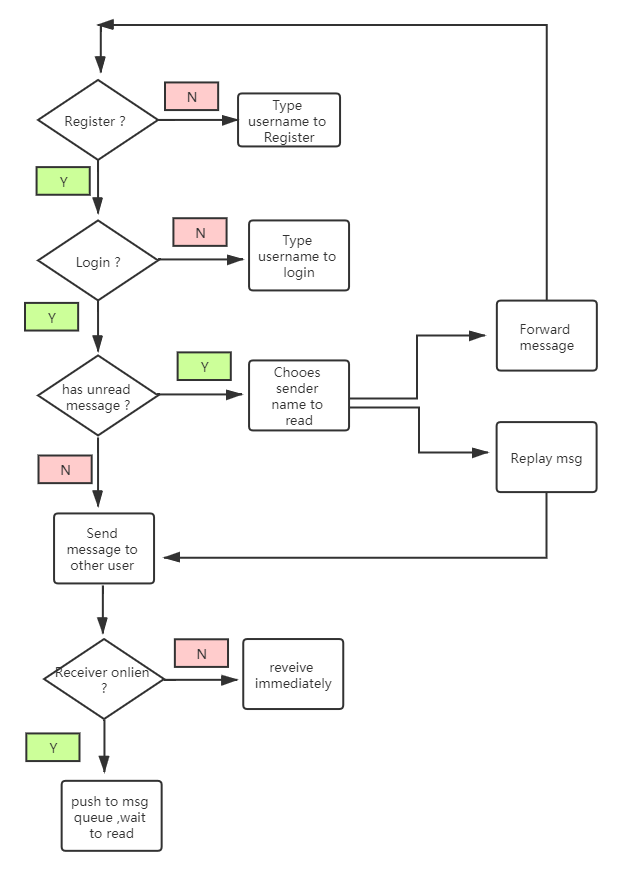
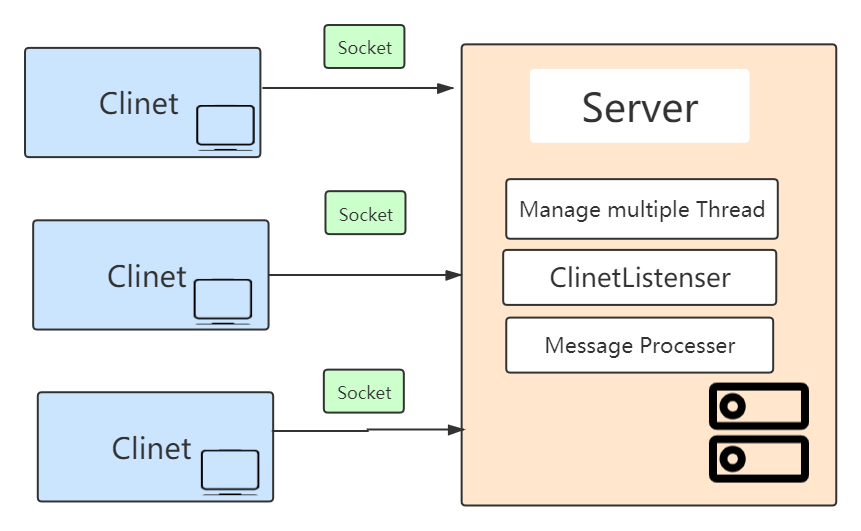

### Small ChatRoom
This project use socket to transfer message between clinet and server,
this project will help you understand more about TCP and input/out stream.

The function implement in this project :
- User Register
- User Login
- Private Chat 
- Broadcast 
- Read message by different sender
- Forward message to defined user

when you run it , remember to start server side first 
Then you can start client side , remember the client number do not exceed max number of Thread pool

Server : `ChatServer.java`
Server : `ChatClient.java`

